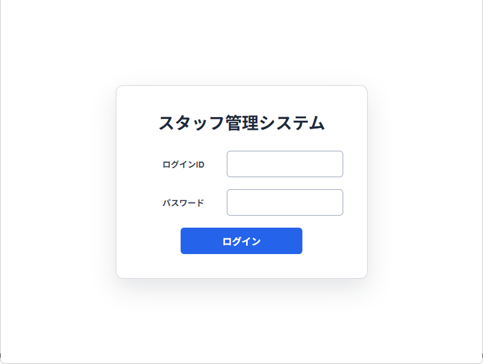
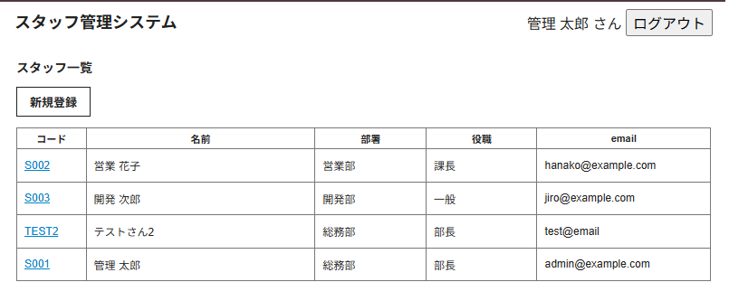
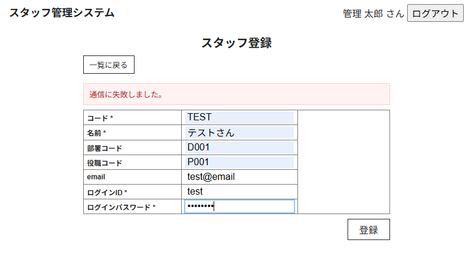
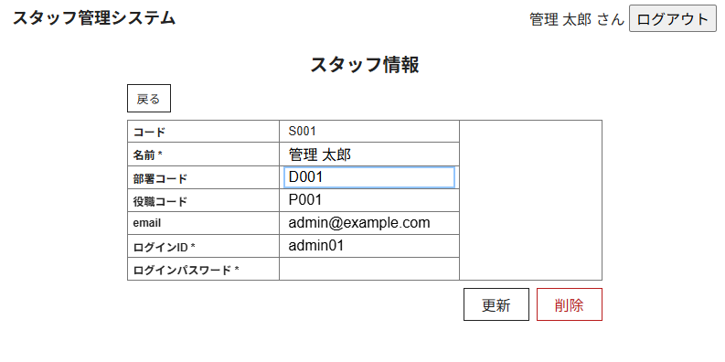
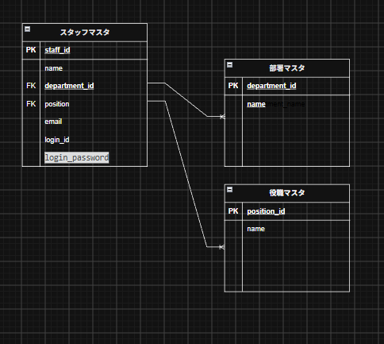

# StaffMaster（スタッフ管理システム）

> スタッフ情報を、一覧・登録・編集・削除まで一元管理できるWebアプリケーションです。  

## アプリケーションURL

- URL：`https://staff-master-tau.vercel.app`
- テスト用ログインID：`admin01`
- テスト用パスワード：`pass123`

## 概要

StaffMasterは、スタッフの基本情報、所属部署、役職を管理するためのWebアプリケーションです。
ログイン後、スタッフ情報の一覧表示・詳細確認・新規登録・編集・削除を行えます。

## 開発背景

スタッフ情報を紙や表計算ソフトで管理していると、情報の検索や更新に時間がかかり、複数人で管理する際に内容の不整合が起こる可能性があります。

そこで、スタッフ情報をブラウザ上で一元管理し、必要な情報を確認・更新できるアプリとして開発しました。ログイン機能により、未認証の利用者がスタッフ管理画面を開けないようにしています。

## 主な機能

### ログイン画面



### スタッフ一覧画面



### スタッフ登録画面



### スタッフ編集画面



※入力不備やAPI通信失敗時に、画面上へメッセージを表示します。 

## 使用技術

### フロントエンド

- React
- Vite
- React Router DOM
- JavaScript
- CSS

### バックエンド

- Java 21
- Spring Boot
- Spring Security
- Spring Data JPA
- Maven

### データベース

- PostgreSQL（Neon）
- H2 Database（ローカル開発用）

### インフラ

- Vercel（フロントエンド）
- Render（バックエンド）
- Neon（データベース）
- GitHub（ソースコード管理）

## ER図



## ローカル環境での起動方法

### 前提条件

- Node.js
- Java 21
- Git

### 1. リポジトリをクローンする

```bash
git clone https://github.com/akarihagiwara/StaffMaster.git
cd StaffMaster
```

### 2. バックエンドを起動する

```bash
cd backend
./mvnw spring-boot:run
```
```text
http://localhost:8080
```

### 3. フロントエンドを起動する

別のターミナルを開いて実行します。

```bash
cd frontend
npm install
npm run dev
```

表示されたURLをブラウザで開きます。

## テスト用アカウント

| ログインID | パスワード |
| --- | --- |
| `admin01` | `pass123` |

